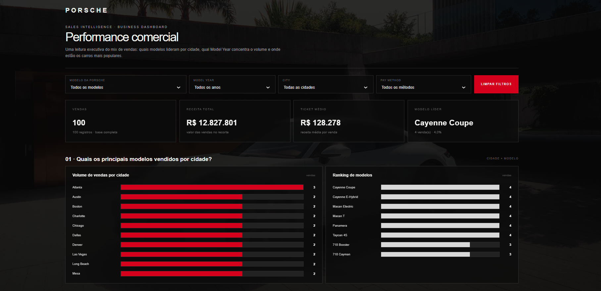
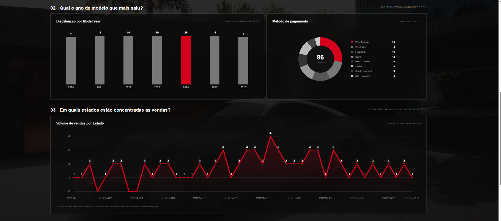
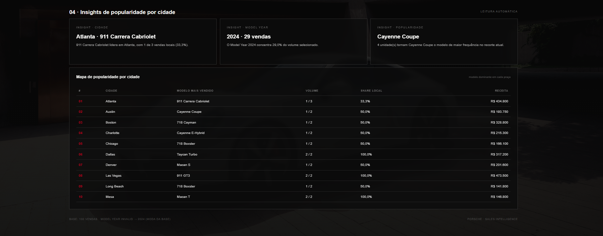

# 🏎️ Porsche Sales Intelligence - Executive Dashboard

Análise comercial avançada e painel interativo de vendas da Porsche, desenvolvido do absoluto zero a partir de uma base de dados sanitizada de 100 registros. Este projeto foi criado como solução para o Desafio de Projeto da **Digital Innovation One (DIO)**.

🔗 **[CLIQUE AQUI PARA ACESSAR O DASHBOARD ONLINE](https://amanda-carvalhosc.github.io/dashboard-porsche-sales/)**

---

## 📸 Demonstração do Projeto e Filtros Aplicados

Aqui estão as evidências visuais do sistema desenvolvido rodando diretamente no navegador:

### Visão Geral do Dashboard Premium

### Análise de Modelos e Métodos de Pagamento

### Filtros Avançados Dinâmicos

---

## 📊 O Desafio Comercial & Perguntas de Negócio
O objetivo principal deste projeto foi transformar uma planilha de vendas bruta em uma ferramenta de tomada de decisão executiva sofisticada, respondendo a três dores reais de um diretor de vendas da Porsche:

1. **Volume e Distribuição Regional:** Quais praças comerciais possuem maior tração de vendas e qual modelo domina cada região? (Respondido no *Mapa de Popularidade* e *Gráfico de Cidades*).
2. **Ciclo de Demanda Temporal:** Qual ano de modelo (*Model Year*) concentra o maior volume de emplacamentos, identificando tendências de mercado? (Respondido no *Gráfico de Linha Temporal*).
3. **Mix de Produtos e Faturamento:** Qual veículo lidera em receita nacional e qual a participação dos métodos de pagamento (Pix, Cartão, Transferência)? (Respondido nos *KPIs de Topo* e *Gráfico de Rosca*).

---

## 🛠️ O Caminho da Análise: Engenharia e Superação Humana

Este portfólio carrega um diferencial único: **ele foi construído utilizando ferramentas 100% gratuitas**, driblando limitações técnicas reais através de criatividade, insistência e controle cirúrgico de processos.

### 1. Tratamento dos Dados no WPS Office
Antes de envolver qualquer inteligência artificial, a base de dados passou por um rigoroso processo de conferência manual e estruturação em tabela dinâmica utilizando o **WPS Office**:
* **Isolamento Sanitizado:** Filtrei e deletei todas as colunas com dados brutos, mantendo estritamente os dados limpos no curso do Expert Felipe Aguiar (Felipão).
* **Automotivação Técnica:** Identifiquei que os números de preços não estavam calculando por incompatibilidade de formato regional (.00). Utilizei as ferramentas de busca e substituição do WPS Office para normalizar os dados para o padrão de cálculo numérico.
* **Layout Avançado:** Ajustei a exibição da tabela dinâmica para o formato clássico/compacto, garantindo que o modelo do carro aparecesse como grupo principal e as cidades como subgrupos, exatamente como em uma aplicação corporativa.

### 2. Engenharia de Prompt e Resiliência com IA
Na fase de geração do código Front-end, utilizei o **ChatGPT gratuito**. Essa etapa exigiu forte mentalidade técnica e persistência:
* **O Erro de Token/Corte:** Devido aos limites de tamanho da mensagem na versão gratuita, a IA cortava o código na metade (interrompendo na tag do gráfico de pagamentos), gerando um arquivo incompleto e sem o "motor" JavaScript.
* **A Solução por Prompt Instrucional:** Em vez de desistir, recusei a alteração manual corretiva. Forcei o ChatGPT através de comandos cirúrgicos e técnicas de otimização de código a entregar o arquivo autocontido, preservando 100% da lógica, os 100 registros de vendas e os gráficos do `Chart.js`.
* **Tratamento de Anomalias (`INVALID` ➔ 2024):** Comandei a IA a fazer o tratamento estatístico de dados na coluna de datas. Os registros corrompidos com o texto `INVALID` foram identificados e mapeados para o ano 2024 (a moda da base), garantindo que os 100 registros entrassem no cálculo sem contaminar os insights.

### 3. Design de Luxo (UI/UX Premium)
Para refletir o posicionamento de mercado da Porsche, comandei a IA a criar um design de alto padrão baseado no site oficial da Porsche Brasil:
* **Tema Escuro (Dark Mode):** Fundo grafite profundo com camadas transparentes (`backdrop-filter`) que trazem profundidade.
* **Destaques da Marca:** Uso do Vermelho Clássico da Porsche para botões, interações e gráficos principais.
* **Atmosfera de Marca:** Injeção de uma imagem responsiva de alta definição do modelo lendário da Porsche fixa ao fundo, combinando perfeitamente com os textos e sem prejudicar a leitura dos dados.

---

## 🚀 Tecnologias Utilizadas
* **WPS Office** (Tratamento e validação de dados)
* **HTML5 / CSS3 Avançado** (Estrutura responsiva e luxuosa)
* **JavaScript Puro** (Filtros dinâmicos em tempo real e processamento da lista de 100 objetos de vendas)
* **Chart.js via CDN** (Renderização gráfica de alta performance)
* **Git & GitHub** (Controle de versão e hospedagem na web via **GitHub Pages**)

---

## 🏆 Lição Aprendida
*Como profissional iniciante na área de dados, este projeto me provou que a mente humana no comando de um prompt bem estruturado vale muito mais do que assinaturas de ferramentas pagas. A dor de cabeça de ler as linhas de código se transformou no orgulho de ver um produto comercial no ar. Não desistir diante do erro técnico é o que separa quem copia código de quem analisa e resolve problemas de verdade!*

---
Desenvolvido com dedicação por **Amanda Carvalho** 👋
# dashboard-porsche-sales
